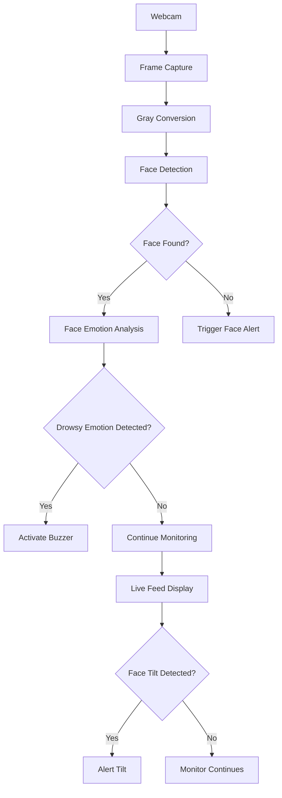

# Driver Safety Monitoring System 🚦

## Table of Contents
- [Features](#features)
- [Prerequisites](#prerequisites)
- [Installation](#installation)
- [Usage](#usage)
- [Technical Architecture](#technical-architecture)
- [Troubleshooting](#troubleshooting)
- [Development Setup](#development-setup)
- [Testing](#testing)
- [Contributing](#contributing)
- [License](#license)
- [Acknowledgments](#acknowledgments)
- [FAQ](#faq)

## Features
- 👁️ Real-time face detection using OpenCV
- 😴 Drowsiness alert based on emotions via DeepFace
- 🔔 Audible alert with buzzer for drowsy states
- 🖥️ Gender and age detection for monitored faces
- 📊 Continuous monitoring through webcam feed
- 🚨 Alerts for missing faces or drowsy behavior

## Prerequisites

| Requirement   | Description |
|--------------|-------------|
| 🐍 Python    | 3.11+ version |
| 📸 Webcam    | Built-in or external |
| 💾 Disk Space | Minimum 1GB free space |
| 💻 RAM       | At least 4GB recommended |

## Installation
Clone the repository and install necessary packages:

```bash
git clone https://github.com/YOUR_USERNAME/driver-safety-monitoring.git
cd driver-safety-monitoring
pip install -r requirements.txt
```

## Usage
Launch the monitoring system:

```bash
python driver_monitor.py
```

Press `q` to terminate the program.

Ensure proper lighting and face positioning for optimal results.

## Technical Architecture



## Troubleshooting

### 🎥 Webcam Not Detected
Check connected video devices:

```bash
ls /dev/video*
```

### 🐌 Performance Issues
Run the program with lower FPS:

```bash
python driver_monitor.py --fps 15
```

### 🔊 Sound Alert Not Working
Ensure `winsound` is enabled (Windows-only). For other systems, adapt the code for compatible sound alerts.

## Development Setup
1. Clone the repository.
2. Create a virtual environment.
3. Install dependencies using `pip`.
4. Test the program with sample video inputs.

## Testing
- Test the system with live webcam monitoring.
- Validate emotion detection for various facial expressions.
- Simulate drowsy conditions to trigger buzzer alerts.

## Contributing
We welcome contributions to enhance this project!

1. Fork the repository.
2. Create a feature branch:

```bash
git checkout -b feat/new-feature
```

3. Commit changes with descriptive messages.
4. Push to your branch and submit a Pull Request.

## License
This project is licensed under the BSD 3-Clause License. See the [LICENSE](LICENSE) file for details.

## Acknowledgments
- OpenCV for real-time face detection.
- DeepFace for emotion recognition.
- TensorFlow for seamless integration.

## FAQ

### 🎥 Q1: Can recorded videos be used instead of live feed?
**A:** Yes, update the video capture line:

```python
cap = cv2.VideoCapture("video.mp4")
```

### 💡 Q2: How to improve detection accuracy?
**A:** Ensure proper lighting, minimal face obstructions, and higher-resolution webcams.

### 📱 Q3: Can the system run on mobile devices?
**A:** Currently, the code is optimized for desktop systems. Mobile support requires additional modifications.